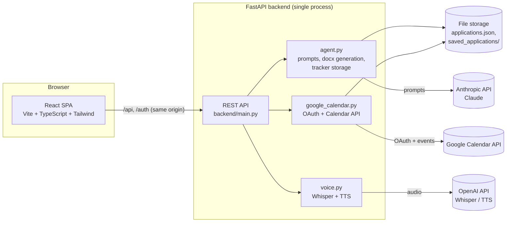

# Career Agent

An AI agent that takes a job posting and turns it into a tailored resume, cover
letter, LinkedIn outreach message, and an interview prep plan — then tracks
the application through to an offer.

## What it does

**1. Application materials**
- Paste a job posting URL (or the raw text) and your resume (`.docx` or pasted text)
- The agent extracts the job description, runs a gap analysis against your resume, and produces a tailored resume, a cover letter, and a short LinkedIn outreach message
- Everything is downloadable as `.docx` and saved to a personal application tracker

**2. Application tracker**
- A table of every application you've generated materials for, with editable status (`Applied → Shortlisted → Interview → Offer / Rejected`), title, company, and location

**3. Interview prep**
- A mock interview chatbot that asks role-specific questions based on the job description and your resume, and scores your answers against weak areas from past sessions
- Optional voice mode (speech-to-text for your answers, text-to-speech for the interviewer) using OpenAI Whisper/TTS
- A generated study schedule for the days leading up to the interview, which can sync directly to Google Calendar (via OAuth) and avoids blocks where you're already busy or have another interview

## Architecture



- **Frontend** — React + TypeScript, built with Vite, styled with Tailwind. Talks to the backend with relative `fetch` calls (`/api/...`, `/auth/...`), so it never hardcodes a host.
- **Backend** — a single FastAPI app (`backend/main.py`) exposing the REST API. In production it also serves the built frontend directly, so the whole app is one origin with no CORS setup.
- **Agent logic** (`agent.py`) — all the LLM prompting (gap analysis, resume tailoring, cover letters, mock interview turns, study schedules), resume/`.docx` parsing and generation, and the JSON-file-based application tracker.
- **Google Calendar** (`google_calendar.py`) — OAuth2 login/token refresh and calendar read/write, used for the "avoid my busy times" scheduling and syncing study blocks.
- **Voice** (`voice.py`) — thin wrapper around OpenAI Whisper (speech-to-text) and TTS (text-to-speech) for the optional voice mock-interview mode.
- **Storage** — no database. Applications and OAuth tokens are stored as JSON/`.docx` files under `DATA_DIR` (defaults to the project root locally; a mounted volume in production). Simple, but single-user and not concurrency-safe — see Future Improvements.

## Tech stack

| Layer | Tools |
|---|---|
| Frontend | React 19, TypeScript, Vite, Tailwind CSS, React Router |
| Backend | Python, FastAPI, Uvicorn |
| AI | Anthropic Claude (text generation), OpenAI Whisper + TTS (voice) |
| Integrations | Google Calendar API (OAuth 2.0) |
| Storage | Flat JSON files + `.docx` files on disk |
| Deployment | Docker (single container) |

## Running locally

```bash
# Backend
python -m venv venv && venv\Scripts\activate   # or source venv/bin/activate on macOS/Linux
pip install -r backend/requirements.txt
cp .env.example .env   # fill in your API keys
uvicorn backend.main:app --reload --port 8000

# Frontend (separate terminal)
cd frontend
npm install
npm run dev
```

The frontend dev server (`localhost:5173`) proxies `/api` and `/auth` requests to the backend (`localhost:8000`), so both need to be running.

## Deployment

The app ships as a single Docker image: a build stage compiles the React frontend, and the runtime stage is the FastAPI backend, which serves both the API and the built frontend from one origin.

```bash
docker build -t career-agent .
docker run -p 8000:8000 \
  -e ANTHROPIC_API_KEY=... \
  -e OPENAI_API_KEY=... \
  -e GOOGLE_CLIENT_ID=... \
  -e GOOGLE_CLIENT_SECRET=... \
  -e GOOGLE_REDIRECT_URI=https://your-domain/auth/google/callback \
  -e FRONTEND_URL=https://your-domain \
  -v career-agent-data:/data \
  career-agent
```

Any container host that supports a `Dockerfile` and a persistent volume works (e.g. Fly.io, Railway, Render). Two things to set up per environment:

1. **Google Cloud Console** — add your production `GOOGLE_REDIRECT_URI` as an authorized redirect URI on the OAuth client.
2. **Persistent volume** — mount it at `/data` (matches `DATA_DIR` in the Dockerfile). Without it, the application tracker and Google tokens reset on every redeploy.

See `.env.example` for the full list of environment variables.

## Future improvements

- **Real database** — swap the JSON-file tracker for Postgres/SQLite to support concurrent writes and multiple users instead of one shared local state
- **Multi-user auth** — currently single-user (no login beyond the optional Google Calendar connection); adding accounts would let this be a hosted product rather than a personal tool
- **Resume format support** — only `.docx` is parsed today; PDF and plain-text upload would cover more resumes
- **Background jobs** — LLM calls (analysis, cover letters, mock interview turns) currently block the request; a task queue would make the UI feel snappier and allow retries on failure
- **Automated tests** — no test suite yet; the prompt-engineering logic in `agent.py` in particular would benefit from regression tests
- **Other calendar providers** — Outlook/iCloud calendar sync alongside Google
